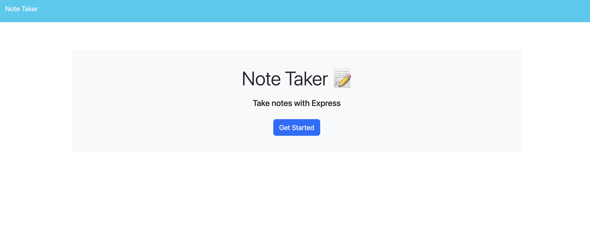
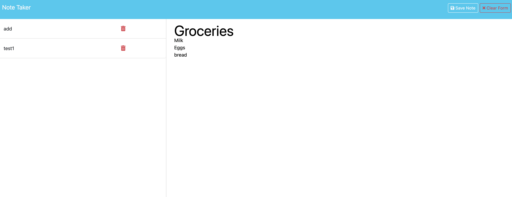

# Note Taker Starter Code# Note Taker Application

## Link
https://note-taker-v0vr.onrender.com/

## Description
The Note Taker application is a simple, user-friendly web app that allows users to write, save, and view notes. It features a clean layout, intuitive functionality, and seamless note management.

## Features
- Landing page with a link to access the notes page.
- Display of existing notes in a left-hand column.
- New note input fields on the right-hand side.
- Buttons for saving, clearing, and starting new notes.

## Acceptance Criteria

- **Landing Page:**
  - When the user opens the Note Taker, they see a landing page with a link to navigate to the notes page.

- **Notes Page:**
  - Clicking the link directs the user to a notes page.
  - The notes page displays existing notes in a left-hand column.
  - The right-hand column contains empty fields for a new note title and the note's content.

- **Creating a Note:**
  - When a user enters a title and text for a new note, a "Save Note" button and a "Clear Form" button appear at the top of the page.
  - Clicking the "Save Note" button saves the note and lists it alongside existing notes in the left column.
  - The save and clear buttons disappear after saving the note.

- **Viewing an Existing Note:**
  - Clicking on an existing note in the list displays it in the right-hand column.
  - A "New Note" button appears in the navigation.

- **Starting a New Note:**
  - Clicking the "New Note" button clears the right-hand column fields for a new entry.
  - The "New Note" button disappears after clearing the form.

## How to Install
1. Clone the repository.
2. Run `npm install` to install dependencies.
3. Start the application with `npm start`.

## Technologies Used
- HTML
- CSS
- JavaScript
- Node.js
- Express
